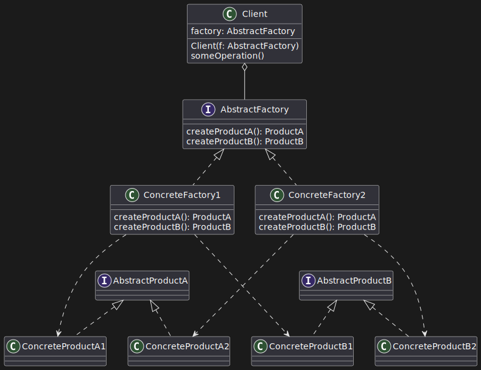

## Problem Statement

You are designing a Vehicle Rental System for a company that rents out different
types of vehicles, such as cars, bikes, and trucks. Each type of vehicle has
unique properties and behaviours, but all vehicles must provide common
functionalities, such as starting, stopping, and displaying rental costs.

The system should be easily extendable, allowing new types of vehicles to be
added in the future with minimal changes to the existing code.

## Points

* Vehicle Rental System rents out different types of vehicles for a company
* Vehicle Rental System should have RentalRecords
* RentalRecords must have the details like type of vehicle, startTime, endTime,
  price, description about the path(Path)
* There must be a class that has the business logic that creates rental record
  and also the vehicle
* Vehicle should have starting of vehicle, stopping of vehicle and displaying
  the rental cost per day

## Implementation

[UML diagram script](./UML_DIAGRAM_SCRIPT.md)

