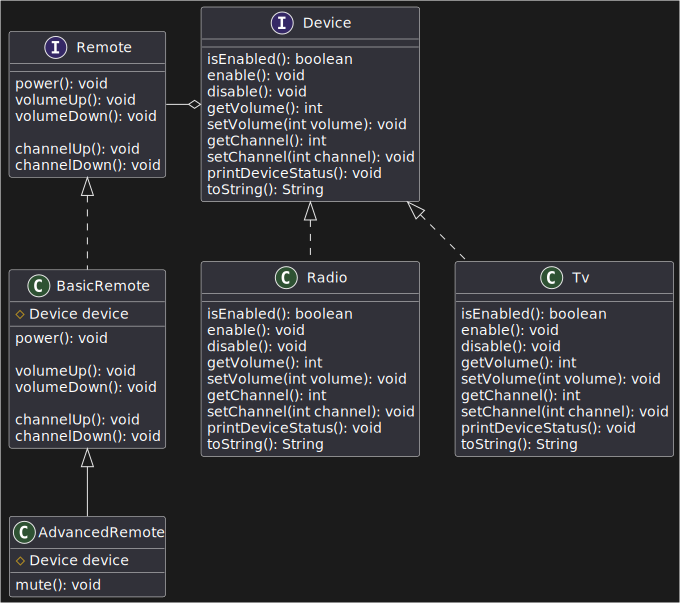

# Problem statement

* Design a system to represent remote controls and the devices they operate. A
  remote control should be able to perform actions such as turning the device on
  or off and adjusting its settings (e.g., volume or channel). Different types
  of devices, such as TVs, radios should support these actions
  but may implement them differently based on their functionalities.

* Your task is to implement:

1. A class hierarchy for devices that defines the common actions all devices
   must support (e.g., power on/off, adjust volume, change channel).
2. A class hierarchy for remote controls that defines the actions a remote can
   perform (e.g., toggle power, change volume, switch channels).
3. Ensure the system is flexible enough to allow new types of devices and
   remote controls to be added without modifying existing code.

# Solution

[solution](./device_remote_bridge_uml.md)
