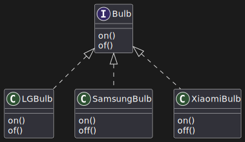

# Abstract Factory

## Introduction

* Creational Design Pattern
* Lets you produces families of related objects 
* without specifying their concrete objects
* Understand the families of related objects clearly: family of objects that are
  related by its variation.

---

For example: 
* As an example, seen the [Smart Home Device Management System](../code/abstract_factory/SmartHomeDeviceManagementSystem/README.md)
* The families are Bulb, Freezer, Television, WashingMachine
* These are related with different type of companies

## Problem Statement

Imagine that you're creating a Smart Home Device Management as said above.

1. A family of related products: Bulb + Freezer + Television + WashingMachine
2. Several variants of this family: Bulb + Freezer + Television + WashingMachine
   are available in the variants: LG Company variant, Samsung Company variant,
   Xiaomi Company variant

| Products/Variants | Bulb         | Freezer         | Television         | WashingMachine         |
|-------------------|--------------|-----------------|--------------------|------------------------|
| LG Company        | LG Bulb      | LG Freezer      | LG Television      | LG WashingMachine      |
| Samsung Company   | Samsung Bulb | Samsung Freezer | Samsung Television | Samsung WashingMachine |
| Xiaomi Company    | Xiaomi Bulb  | Xiaomi Freezer  | Xiaomi Television  | Xiaomi WashingMachine  |

You need a way to create individual Home Devices so that they match other
Devices of the same family.

Also, you don't want to change existing code when adding new products or
families of products to the program. Home can update their devices often, and
you wouldn't want to change the core code each time it happens.

## Solution

1. The first thing the Abstract Factory Pattern suggests is to explicitly
   declare interfaces for each distinct product of the product family(Like:
   Bulb, Freezer, Television, WashingMachine). 
2. Then you can make all variants of products following those interfaces. 

3. The next move is to declare the Abstract Factory -- an interface with a list
   of creation methods for all products that are part of the product family(for
   example, `createBulb()`, `createFreezer()`, `createTelevision()`,
   `createWashingMachine()`). These methods must return abstract product types
   represented by the interfaces we extracted previously: Bulb, Freezer,
   Television, WashingMachine and so on.

4. Now create all the variants of the Abstract Factory which produces the same
   products by variants

5. Use these variants factories to create the families of products

## Example code
~/vimwiki/OOPs/code/designpatterns/src/main/java/code/abstract_factory/WebApplication/WebApplication.java

1. [Smart Home Device Management System](../code/designpatterns/src/main/java/code/abstract_factory/SmartHomeDeviceManagementSystem/README.md)
2. [GUI components](https://refactoring.guru/design-patterns/abstract-factory/java/example)
